# 🏗️ DeDevs UI Architecture Overview

This document provides a comprehensive architectural overview of the DeDevs UI Design Registry, a production-ready component registry system built with modern tooling and best practices.

## 🎯 System Overview

DeDevs UI is a monorepo-based design system that provides:

* **Component Registry**: A shadcn/ui-compatible component library
* **CLI Tool**: Command-line interface for component installation
* **Documentation Site**: Interactive documentation with live examples
* **Build System**: Automated component discovery and registry generation

## 🏛️ High-Level Architecture

```mermaid
graph TB
    subgraph "External Users"
        DEV["👨‍💻 Developers"]
        CLI_USER["🖥️ CLI Users"]
        WEB_USER["🌐 Web Users"]
    end

    subgraph "DeDevs UI System"
        subgraph "Distribution Layer"
            NPM["📦 NPM Registry"]
            CDN["🌐 CDN"]
        end

        subgraph "Applications"
            DOCS["📚 Documentation Site\n(Next.js)"]
            WEB["🏠 Landing Page\n(Next.js)"]
            CLI["⚡ CLI Tool\n(Node.js)"]
        end

        subgraph "Core Packages"
            AI["🤖 AI Components"]
            CODE["💻 Code Block"]
            EDITOR["✏️ Editor"]
            SHADCN["🎨 Shadcn UI"]
            SNIPPET["📝 Snippet"]
        end

        subgraph "Build System"
            TURBO["⚡ Turborepo"]
            REGISTRY["📋 Registry Generator"]
            DISCOVERY["🔍 Component Discovery"]
        end

        subgraph "Configuration"
            WORKSPACE["📁 PNPM Workspace"]
            TSCONFIG["⚙️ TypeScript Config"]
            ESLINT["🔍 ESLint Config"]
        end
    end

    DEV --> DOCS
    CLI_USER --> CLI
    WEB_USER --> WEB
    
    CLI --> NPM
    DOCS --> CDN
    
    DOCS --> AI
    DOCS --> CODE
    DOCS --> EDITOR
    DOCS --> SHADCN
    DOCS --> SNIPPET
    
    TURBO --> DOCS
    TURBO --> WEB
    TURBO --> CLI
    
    REGISTRY --> AI
    REGISTRY --> CODE
    REGISTRY --> EDITOR
    REGISTRY --> SHADCN
    REGISTRY --> SNIPPET
    
    DISCOVERY --> REGISTRY
```

## 📁 Monorepo Structure

```mermaid
graph TD
    ROOT["🏠 dedevs-ui/"]
    
    subgraph "Applications"
        APPS["📱 apps/"]
        DOCS_APP["📚 docs/\n(Documentation Site)"]
        WEB_APP["🌐 web/\n(Landing Page)"]
    end
    
    subgraph "Shared Packages"
        PACKAGES["📦 packages/"]
        AI_PKG["🤖 ai/\n(AI Components)"]
        CODE_PKG["💻 code-block/\n(Code Display)"]
        EDITOR_PKG["✏️ editor/\n(Editor Components)"]
        SHADCN_PKG["🎨 shadcn-ui/\n(Base Components)"]
        SNIPPET_PKG["📝 snippet/\n(Code Snippets)"]
        ESLINT_PKG["🔍 eslint-config/\n(Linting Rules)"]
        TS_PKG["⚙️ typescript-config/\n(TS Configuration)"]
    end
    
    subgraph "Build & Scripts"
        SCRIPTS["🔧 scripts/"]
        CLI_SCRIPT["⚡ index.ts\n(CLI Entry Point)"]
        REGISTRY_SCRIPT["📋 generateRegistry.ts\n(Registry Generator)"]
    end
    
    subgraph "Configuration"
        CONFIG["⚙️ Configuration Files"]
        TURBO_CONFIG["⚡ turbo.json"]
        WORKSPACE_CONFIG["📁 pnpm-workspace.yaml"]
        PACKAGE_JSON["📦 package.json"]
        REGISTRY_JSON["📋 registry.json"]
    end
    
    ROOT --> APPS
    ROOT --> PACKAGES
    ROOT --> SCRIPTS
    ROOT --> CONFIG
    
    APPS --> DOCS_APP
    APPS --> WEB_APP
    
    PACKAGES --> AI_PKG
    PACKAGES --> CODE_PKG
    PACKAGES --> EDITOR_PKG
    PACKAGES --> SHADCN_PKG
    PACKAGES --> SNIPPET_PKG
    PACKAGES --> ESLINT_PKG
    PACKAGES --> TS_PKG
    
    SCRIPTS --> CLI_SCRIPT
    SCRIPTS --> REGISTRY_SCRIPT
    
    CONFIG --> TURBO_CONFIG
    CONFIG --> WORKSPACE_CONFIG
    CONFIG --> PACKAGE_JSON
    CONFIG --> REGISTRY_JSON
```

## 🔄 Component Lifecycle

```mermaid
sequenceDiagram
    participant DEV as 👨‍💻 Developer
    participant COMP as 📦 Component
    participant DISC as 🔍 Discovery
    participant REG as 📋 Registry
    participant BUILD as ⚡ Build
    participant DOCS as 📚 Docs
    participant CLI as 🖥️ CLI
    participant USER as 👤 End User

    DEV->>COMP: Create/Update Component
    COMP->>DISC: Component Discovery
    DISC->>REG: Generate Registry Entry
    REG->>BUILD: Trigger Build Process
    BUILD->>DOCS: Update Documentation
    BUILD->>CLI: Update CLI Registry
    
    USER->>CLI: npx dedevs-ui add component
    CLI->>REG: Fetch Component Info
    REG->>USER: Install Component Files
    
    USER->>DOCS: Browse Components
    DOCS->>REG: Load Component Examples
    REG->>USER: Display Interactive Examples
```

## 🛠️ Build System Architecture

```mermaid
graph LR
    subgraph "Source Code"
        COMPONENTS["📦 Components\n(packages/*)"]
        APPS_SRC["📱 Applications\n(apps/*)"]
    end
    
    subgraph "Build Pipeline"
        TURBO["⚡ Turborepo\nOrchestrator"]
        
        subgraph "Component Processing"
            DISCOVERY["🔍 Component\nDiscovery"]
            REGISTRY_GEN["📋 Registry\nGeneration"]
            VALIDATION["✅ Component\nValidation"]
        end
        
        subgraph "Application Builds"
            DOCS_BUILD["📚 Docs Build\n(Next.js)"]
            WEB_BUILD["🌐 Web Build\n(Next.js)"]
            CLI_BUILD["⚡ CLI Build\n(tsup)"]
        end
    end
    
    subgraph "Output Artifacts"
        REGISTRY_JSON["📋 registry.json"]
        DOCS_DIST["📚 Documentation\nSite"]
        WEB_DIST["🌐 Landing\nPage"]
        CLI_DIST["⚡ CLI\nExecutable"]
    end
    
    COMPONENTS --> DISCOVERY
    APPS_SRC --> TURBO
    
    TURBO --> DISCOVERY
    TURBO --> DOCS_BUILD
    TURBO --> WEB_BUILD
    TURBO --> CLI_BUILD
    
    DISCOVERY --> REGISTRY_GEN
    REGISTRY_GEN --> VALIDATION
    VALIDATION --> REGISTRY_JSON
    
    DOCS_BUILD --> DOCS_DIST
    WEB_BUILD --> WEB_DIST
    CLI_BUILD --> CLI_DIST
    
    REGISTRY_JSON --> DOCS_DIST
    REGISTRY_JSON --> CLI_DIST
```

## 🎨 Component Package Architecture

```mermaid
graph TB
    subgraph "Component Package Structure"
        PKG["📦 Package Root"]
        
        subgraph "Core Files"
            INDEX["📄 index.tsx\n(Main Export)"]
            PACKAGE_JSON["📦 package.json\n(Dependencies)"]
            TSCONFIG["⚙️ tsconfig.json\n(TS Config)"]
        end
        
        subgraph "Component Files"
            COMPONENTS["🎨 Component Files\n(.tsx)"]
            TYPES["📝 Type Definitions\n(.d.ts)"]
            STYLES["💅 Styles\n(CSS/Tailwind)"]
        end
        
        subgraph "Documentation"
            README["📖 README.md"]
            EXAMPLES["📋 Examples\n(.example.tsx)"]
        end
        
        subgraph "Testing"
            TESTS["🧪 Tests\n(.test.tsx)"]
            STORIES["📚 Stories\n(.stories.tsx)"]
        end
    end
    
    PKG --> INDEX
    PKG --> PACKAGE_JSON
    PKG --> TSCONFIG
    PKG --> COMPONENTS
    PKG --> TYPES
    PKG --> STYLES
    PKG --> README
    PKG --> EXAMPLES
    PKG --> TESTS
    PKG --> STORIES
    
    INDEX --> COMPONENTS
    COMPONENTS --> TYPES
    COMPONENTS --> STYLES
```

## 🖥️ CLI Architecture

```mermaid
graph TD
    subgraph "CLI Entry Point"
        ENTRY["⚡ scripts/index.ts"]
    end
    
    subgraph "Command Processing"
        PARSER["📝 Argument Parser"]
        VALIDATOR["✅ Command Validator"]
        ROUTER["🔀 Command Router"]
    end
    
    subgraph "Commands"
        LIST["📋 list/ls\n(List Components)"]
        ADD["➕ add\n(Install Components)"]
        HELP["❓ help\n(Show Help)"]
        VERSION["🏷️ version\n(Show Version)"]
    end
    
    subgraph "Core Services"
        REGISTRY_CLIENT["📋 Registry Client"]
        FILE_MANAGER["📁 File Manager"]
        DEPENDENCY_MANAGER["📦 Dependency Manager"]
        CONFIG_MANAGER["⚙️ Config Manager"]
    end
    
    subgraph "External Services"
        NPM_REGISTRY["📦 NPM Registry"]
        GITHUB_API["🐙 GitHub API"]
        LOCAL_FS["💾 Local File System"]
    end
    
    ENTRY --> PARSER
    PARSER --> VALIDATOR
    VALIDATOR --> ROUTER
    
    ROUTER --> LIST
    ROUTER --> ADD
    ROUTER --> HELP
    ROUTER --> VERSION
    
    LIST --> REGISTRY_CLIENT
    ADD --> REGISTRY_CLIENT
    ADD --> FILE_MANAGER
    ADD --> DEPENDENCY_MANAGER
    ADD --> CONFIG_MANAGER
    
    REGISTRY_CLIENT --> NPM_REGISTRY
    REGISTRY_CLIENT --> GITHUB_API
    FILE_MANAGER --> LOCAL_FS
    DEPENDENCY_MANAGER --> LOCAL_FS
    CONFIG_MANAGER --> LOCAL_FS
```

## 📚 Documentation Site Architecture

```mermaid
graph TB
    subgraph "Next.js App Router"
        APP["📱 app/"]
        
        subgraph "Route Structure"
            ROOT_LAYOUT["🏠 layout.tsx\n(Root Layout)"]
            HOME["🏠 page.tsx\n(Home Page)"]
            DOCS_LAYOUT["📚 (docs)/layout.tsx\n(Docs Layout)"]
            DOCS_PAGES["📄 [[...slug]]/page.tsx\n(Dynamic Docs)"]
        end
    end
    
    subgraph "Components"
        COMPONENTS["🎨 components/"]
        
        subgraph "UI Components"
            PREVIEW["👁️ Preview\n(Component Preview)"]
            CODE_BLOCK["💻 Code Block\n(Syntax Highlighting)"]
            NAVIGATION["🧭 Navigation\n(Sidebar/Header)"]
        end
        
        subgraph "Layout Components"
            HEADER["📋 Header"]
            SIDEBAR["📝 Sidebar"]
            FOOTER["📄 Footer"]
        end
    end
    
    subgraph "Content Management"
        CONTENT["📖 content/"]
        MDX["📝 MDX Files"]
        EXAMPLES["📋 examples/"]
    end
    
    subgraph "Static Assets"
        PUBLIC["🌐 public/"]
        REGISTRY_STATIC["📋 registry/\n(Generated)"]
        IMAGES["🖼️ Images"]
    end
    
    subgraph "Configuration"
        NEXT_CONFIG["⚙️ next.config.mjs"]
        TAILWIND_CONFIG["🎨 tailwind.config.js"]
        SOURCE_CONFIG["📖 source.config.ts"]
    end
    
    APP --> ROOT_LAYOUT
    APP --> HOME
    APP --> DOCS_LAYOUT
    APP --> DOCS_PAGES
    
    COMPONENTS --> PREVIEW
    COMPONENTS --> CODE_BLOCK
    COMPONENTS --> NAVIGATION
    COMPONENTS --> HEADER
    COMPONENTS --> SIDEBAR
    COMPONENTS --> FOOTER
    
    DOCS_PAGES --> MDX
    DOCS_PAGES --> EXAMPLES
    
    PREVIEW --> REGISTRY_STATIC
    CODE_BLOCK --> EXAMPLES
    
    PUBLIC --> REGISTRY_STATIC
    PUBLIC --> IMAGES
```

## 🔧 Development Workflow

```mermaid
sequenceDiagram
    participant DEV as 👨‍💻 Developer
    participant GIT as 🐙 Git Repository
    participant TURBO as ⚡ Turborepo
    participant BUILD as 🔨 Build System
    participant TEST as 🧪 Test Suite
    participant DEPLOY as 🚀 Deployment

    DEV->>GIT: git commit & push
    GIT->>TURBO: Trigger build pipeline
    
    TURBO->>BUILD: Run component discovery
    BUILD->>BUILD: Generate registry.json
    BUILD->>BUILD: Build documentation
    BUILD->>BUILD: Build CLI tool
    
    TURBO->>TEST: Run test suite
    TEST->>TEST: Component tests
    TEST->>TEST: Integration tests
    TEST->>TEST: E2E tests
    
    TEST->>DEPLOY: Tests pass
    DEPLOY->>DEPLOY: Deploy documentation
    DEPLOY->>DEPLOY: Publish CLI to NPM
    DEPLOY->>DEV: Deployment complete
```

## 🔌 Integration Points

### External Dependencies

* **Next.js**: Application framework for docs and web apps
* **React**: UI library for components
* **Tailwind CSS**: Utility-first CSS framework
* **TypeScript**: Type-safe JavaScript
* **Turborepo**: Monorepo build system
* **PNPM**: Package manager with workspace support
* **Shadcn/UI**: Base component library

### Internal Dependencies

```mermaid
graph LR
    subgraph "Shared Configurations"
        ESLINT_CONFIG["🔍 eslint-config"]
        TS_CONFIG["⚙️ typescript-config"]
    end
    
    subgraph "Component Packages"
        AI["🤖 ai"]
        CODE["💻 code"]
        SHADCN["🎨 shadcn-ui"]
    end
    
    subgraph "Applications"
        DOCS["📚 docs"]
        WEB["🌐 web"]
    end
    
    ESLINT_CONFIG --> AI
    ESLINT_CONFIG --> CODE
    ESLINT_CONFIG --> DOCS
    ESLINT_CONFIG --> WEB
    
    TS_CONFIG --> AI
    TS_CONFIG --> CODE
    TS_CONFIG --> DOCS
    TS_CONFIG --> WEB
    
    SHADCN --> AI
    SHADCN --> CODE
    
    AI --> DOCS
    CODE --> DOCS
```

## 🚀 Deployment Architecture

```mermaid
graph TB
    subgraph "Source Control"
        GITHUB["🐙 GitHub Repository"]
    end
    
    subgraph "CI/CD Pipeline"
        ACTIONS["⚡ GitHub Actions"]
        
        subgraph "Build Jobs"
            BUILD_DOCS["📚 Build Docs"]
            BUILD_CLI["⚡ Build CLI"]
            BUILD_WEB["🌐 Build Web"]
            RUN_TESTS["🧪 Run Tests"]
        end
    end
    
    subgraph "Deployment Targets"
        VERCEL["▲ Vercel\n(Documentation)"]
        NPM["📦 NPM Registry\n(CLI Tool)"]
        CDN["🌐 CDN\n(Static Assets)"]
    end
    
    subgraph "Monitoring"
        ANALYTICS["📊 Analytics"]
        SENTRY["🐛 Error Tracking"]
        LOGS["📋 Logging"]
    end
    
    GITHUB --> ACTIONS
    
    ACTIONS --> BUILD_DOCS
    ACTIONS --> BUILD_CLI
    ACTIONS --> BUILD_WEB
    ACTIONS --> RUN_TESTS
    
    BUILD_DOCS --> VERCEL
    BUILD_CLI --> NPM
    BUILD_WEB --> VERCEL
    
    VERCEL --> ANALYTICS
    VERCEL --> SENTRY
    NPM --> LOGS
```

## 📊 Performance Considerations

### Build Performance

* **Turborepo Caching**: Intelligent build caching across packages
* **Incremental Builds**: Only rebuild changed packages
* **Parallel Execution**: Concurrent package builds
* **Remote Caching**: Shared cache across team members

### Runtime Performance

* **Code Splitting**: Automatic code splitting in Next.js apps
* **Tree Shaking**: Remove unused code from bundles
* **Component Lazy Loading**: Load components on demand
* **Static Generation**: Pre-generate documentation pages

### CLI Performance

* **Minimal Dependencies**: Keep CLI bundle size small
* **Streaming Downloads**: Stream component files during installation
* **Caching**: Cache registry data locally
* **Parallel Operations**: Concurrent file operations

## 🔒 Security Considerations

### Package Security

* **Dependency Scanning**: Regular security audits
* **Version Pinning**: Lock dependency versions
* **Minimal Permissions**: Least privilege access
* **Code Signing**: Sign CLI releases

### API Security

* **Rate Limiting**: Prevent API abuse
* **Input Validation**: Sanitize user inputs
* **HTTPS Only**: Secure transport layer
* **Token Management**: Secure API key handling

## 📈 Scalability Architecture

```mermaid
graph TB
    subgraph "Horizontal Scaling"
        LOAD_BALANCER["⚖️ Load Balancer"]
        
        subgraph "Application Instances"
            DOCS1["📚 Docs Instance 1"]
            DOCS2["📚 Docs Instance 2"]
            DOCS3["📚 Docs Instance 3"]
        end
    end
    
    subgraph "Content Delivery"
        CDN_GLOBAL["🌐 Global CDN"]
        
        subgraph "Edge Locations"
            EDGE_US["🇺🇸 US East"]
            EDGE_EU["🇪🇺 Europe"]
            EDGE_ASIA["🌏 Asia Pacific"]
        end
    end
    
    subgraph "Data Layer"
        REGISTRY_CACHE["📋 Registry Cache"]
        COMPONENT_CACHE["🎨 Component Cache"]
        STATIC_ASSETS["📁 Static Assets"]
    end
    
    LOAD_BALANCER --> DOCS1
    LOAD_BALANCER --> DOCS2
    LOAD_BALANCER --> DOCS3
    
    CDN_GLOBAL --> EDGE_US
    CDN_GLOBAL --> EDGE_EU
    CDN_GLOBAL --> EDGE_ASIA
    
    DOCS1 --> REGISTRY_CACHE
    DOCS2 --> REGISTRY_CACHE
    DOCS3 --> REGISTRY_CACHE
    
    EDGE_US --> COMPONENT_CACHE
    EDGE_EU --> COMPONENT_CACHE
    EDGE_ASIA --> COMPONENT_CACHE
    
    COMPONENT_CACHE --> STATIC_ASSETS
```

## 🔄 Data Flow Architecture

```mermaid
sequenceDiagram
    participant USER as 👤 User
    participant CLI as 🖥️ CLI
    participant REGISTRY as 📋 Registry
    participant CDN as 🌐 CDN
    participant DOCS as 📚 Documentation
    participant FS as 💾 File System

    Note over USER,FS: Component Installation Flow
    
    USER->>CLI: npx dedevs-ui add button
    CLI->>REGISTRY: Fetch component metadata
    REGISTRY->>CLI: Return component info
    CLI->>CDN: Download component files
    CDN->>CLI: Stream component code
    CLI->>FS: Write files to project
    CLI->>FS: Update dependencies
    CLI->>USER: Installation complete
    
    Note over USER,FS: Documentation Browsing Flow
    
    USER->>DOCS: Visit component page
    DOCS->>REGISTRY: Load component data
    REGISTRY->>DOCS: Return metadata & examples
    DOCS->>CDN: Load component assets
    CDN->>DOCS: Serve static files
    DOCS->>USER: Render interactive page
```

## 🎯 Future Architecture Considerations

### Planned Enhancements

* **Plugin System**: Extensible architecture for custom components
* **Theme Engine**: Dynamic theming and customization
* **Component Variants**: Multiple implementation options
* **Version Management**: Semantic versioning for components
* **Analytics Dashboard**: Usage metrics and insights
* **AI Integration**: Intelligent component recommendations

### Technical Debt

* **Legacy Browser Support**: Gradual modernization
* **Bundle Size Optimization**: Further size reductions
* **Performance Monitoring**: Enhanced observability
* **Testing Coverage**: Comprehensive test suite expansion

***

*This architecture documentation is maintained by the DeDevs UI team and updated regularly to reflect system changes and improvements.*
